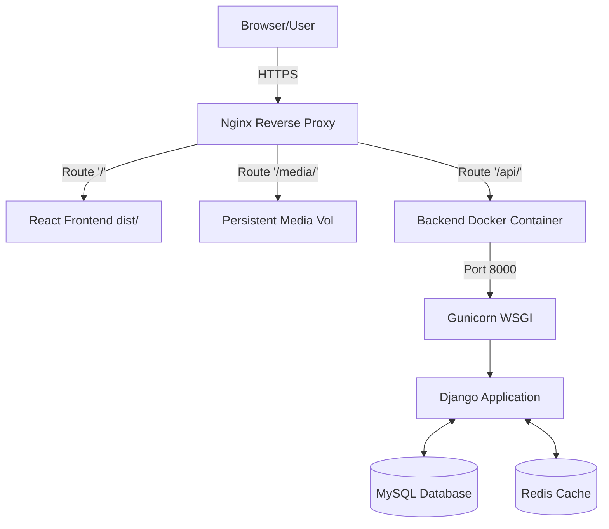

# Aequosia

A complete, production-ready full-stack open-source social media application. 

This project combines a **Django REST Framework (DRF)** backend with a modern, lightning-fast **React + Vite** single-page application (SPA). It features full CI/CD automation, persistent Docker containerization, and a secure Nginx reverse proxy architecture.

---

## 🚀 Live Demo

**Live Web Application:**  
👉 [https://social-media-api.backendforge.qd.je](https://social-media-api.backendforge.qd.je)

**Interactive API Documentation (Swagger):**  
👉 [https://social-media-api.backendforge.qd.je/api/docs/](https://social-media-api.backendforge.qd.je/api/docs/)

---

## ✨ Features

### 💻 Frontend (React SPA)
- **Modern UI**: Clean, responsive design built entirely with **Tailwind CSS**.
- **State Management & Auth**: Persistent JWT authentication using React `AuthContext` and Axios interceptors for automatic background token refreshing.
- **Dynamic Routing**: User profiles are resolved dynamically (e.g., `/profile/:username`).
- **Interactive Feed & Socials**: 
  - Like, comment, and delete posts in real-time.
  - Follow/Unfollow users with immediate UI updates.
- **Advanced Pagination**: "Load More" functionality implemented for Follower/Following lists and Global Search results to handle massive datasets gracefully.
- **Media Handling**: Profile picture (PFP) and post image uploads, correctly rendered from the backend API.

### ⚙️ Backend (Django API)
- **Robust Authentication**: Secure login/registration via JWT.
- **Complex Relationships**: Self-referential Many-to-Many models for the Follower system.
- **Performance Optimized**: 
  - Redis caching for feed, posts, and comments.
  - Query optimization using `select_related` and `prefetch_related` to eliminate N+1 query problems.
- **Throttling & Security**: Granular API rate limiting applied per user and anonymous IPs.
- **Fully Documented**: Automated OpenAPI schema generation via `drf-spectacular`.

### 🏗️ DevOps & Deployment
- **Dockerized**: Containerized backend for consistent environments.
- **CI/CD Pipeline**: GitHub Actions automatically runs all 15 test suites, validates the React build, SSHs into the production Oracle VM, rebuilds the Docker container, and runs migrations on every push to `main`.
- **Zero-Downtime Media**: Persistent Docker volume mounts guarantee uploaded user images are never lost during deployments.

---

## 🛠️ Tech Stack

### Frontend
- **React.js 18** + **Vite**
- **Tailwind CSS**
- **Axios** (HTTP client with auth interceptors)
- **Lucide React** (Icons)
- **React Router Dom**

### Backend
- **Python 3.12** + **Django 6.0**
- **Django REST Framework (DRF)**
- **SimpleJWT** (Authentication)
- **MySQL** (Primary Database)
- **Redis** (Caching layer)

### Infrastructure & Deployment
- **GitHub Actions** (CI/CD)
- **Docker** (Containerization)
- **Nginx** (Reverse Proxy & Static File Server)
- **Gunicorn** (WSGI Application Server)
- **Oracle Cloud VM** (Ubuntu Linux Hosting)

---

## 🏗️ Architecture

### Production Deployment Flow


### CI/CD Pipeline
1. Push to `main`.
2. GitHub Actions tests Django backend (SQLite memory) and builds React UI.
3. SSH into Oracle VM → `git reset --hard` → Pull updates.
4. Rebuild React `dist/` folder on VM.
5. Rebuild and deploy Docker image with `--network host` and persistent volume mounts.
6. Auto-run Django database migrations and static collection.

---

## 📁 Project Structure

```text
social_media_api/
├── .github/workflows/       # CI/CD deployment pipeline
├── apps/                    # Django Backend Applications
│   ├── users/               # Auth, Profiles, Follow logic
│   └── posts/               # Feed, Posts, Likes, Comments
├── config/                  # Django project settings & URLs
├── frontend/                # React SPA source code
│   ├── src/
│   │   ├── api/             # Axios instance & interceptors
│   │   ├── components/      # Reusable UI components
│   │   ├── context/         # AuthContext
│   │   ├── pages/           # Route views
│   │   └── utils/           # Helper functions (Image parsing)
│   ├── vite.config.js
│   └── tailwind.config.js
├── media/                   # User uploaded files (Git ignored)
├── Dockerfile               # Backend Docker configuration
├── pyproject.toml           # Python/Poetry dependencies
└── manage.py
```

---

## 🚀 Installation & Local Development

### 1. Clone the repository
```bash
git clone https://github.com/yashsaxena15/social-media-api.git
cd social-media-api
```

### 2. Environment Variables
Create a `.env` file in the root directory:
```env
SECRET_KEY=your_secret_key
DEBUG=True
DB_ENGINE=django.db.backends.mysql
DB_NAME=social_media_db
DB_USER=root
DB_PASSWORD=yourpassword
DB_HOST=127.0.0.1
DB_PORT=3306
# Optional: REDIS_URL=redis://127.0.0.1:6379/1
```
*(If `REDIS_URL` is omitted, the app will gracefully fallback to local memory caching.)*

### 3. Backend Setup
```bash
# Install dependencies using Poetry
poetry install

# Apply migrations
poetry run python manage.py migrate

# Run the development server
poetry run python manage.py runserver
```

### 4. Frontend Setup
```bash
# Open a new terminal tab and enter the frontend folder
cd frontend

# Install Node dependencies
npm install

# Start the Vite development server
npm run dev
```
*(Note: `vite.config.js` is already configured with an API proxy, so no CORS issues will occur during local development!)*

---

## 🧪 Test Users

You can immediately test the application using these mock accounts (or register your own):

- **Username**: `jenna67` | **Password**: `password123`
- **Username**: `angelava` | **Password**: `password123`
- **Username**: `david51` | **Password**: `password123`

---

## 👨‍💻 Author

**Yash Saxena**  
Computer Science Engineer
