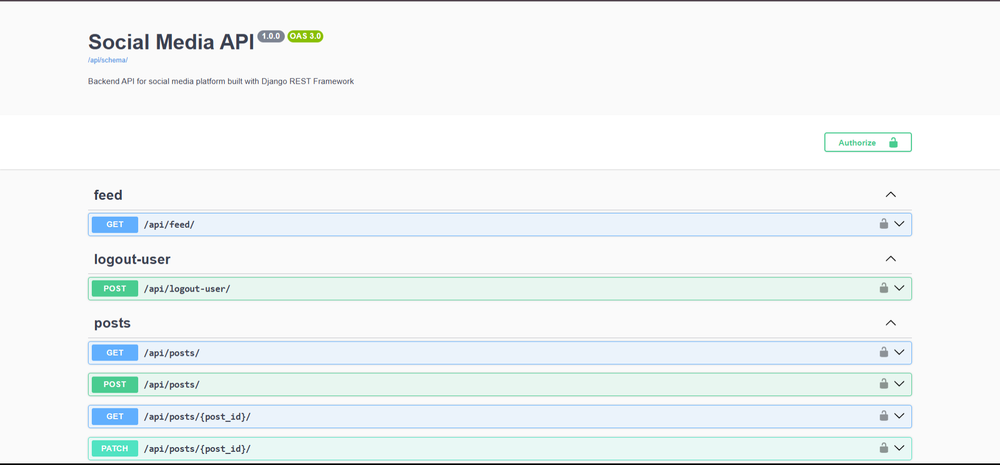
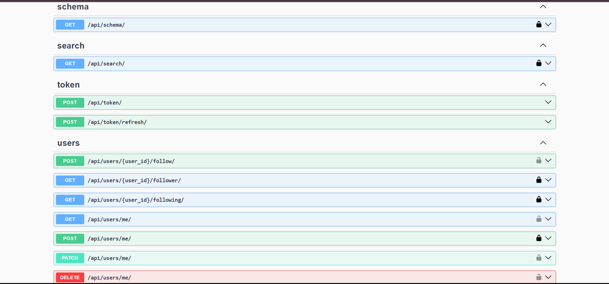

# Social Media API

A backend API for a social media platform built using Django REST Framework.

This project demonstrates core backend features such as authentication, posts, likes, comments, follow system, feed generation, search, pagination, and API documentation.

---

## Highlights

- Production-ready backend architecture
- JWT authentication system
- Redis caching implementation
- Optimized database queries
- Clean modular architecture
- Production deployment on cloud VM

---

## Live API

Base URL  
https://social-media-api-5352.onrender.com

Swagger Documentation  
https://social-media-api-5352.onrender.com/api/docs/

#### ⚠️ Note: This API is deployed on Render free tier, so the first request may take ~30 seconds due to cold start.

### Faster API (Oracle Cloud Deployment)

Base URL  
http://129.154.242.74/

Swagger Documentation  
http://129.154.242.74/api/docs/#/

---

## Features

- User Registration
- JWT Authentication
- User Profile System
- Create / Update / Delete Posts
- Like System
- Comment System
- Follow / Followers
- Feed (Posts from followed users)
- Global Search (users + posts)
- Pagination
- API Throttling
- Swagger API Documentation

---

## Tech Stack

Backend:
- Python
- Django
- Django REST Framework

Authentication:
- JWT (SimpleJWT)

Database:
- MySQL (Oracle Cloud VM )
- PostgreSQL (render)

API Documentation:
- drf-spectacular (Swagger)

Deployment:
- Render
- Oracle Cloud VM
- Nginx
- Gunicorn
- Linux (Ubuntu)

---

## Production Deployment

This API is deployed using production-grade architecture:

- Nginx (Reverse Proxy)
- Gunicorn (WSGI Server)
- MySQL (Database)
- Redis (Caching)
- Oracle Cloud VM (Infrastructure)
- Linux (Ubuntu Server)

Deployment Architecture:

Client  
   ↓  
Nginx (Reverse Proxy)  
   ↓  
Gunicorn (WSGI Server)  
   ↓  
Django REST Framework  
   ↓  
MySQL Database + Redis Cache

--- 

## Database Design

Main Models:

- User
- Profile
- Post
- Like
- Comment
- Follow

Relationships:

User → Post (One to Many)  
Post → Comment (One to Many)  
User → Follow → User (Self Many-to-Many)

---

## Project Architecture

```
social_media_api/
│
├── apps/
│   ├── users/
│   │   ├── authentication
│   │   ├── profile
│   │   └── follow
│   │
│   └── posts/
│       ├── posts
│       ├── likes
│       └── comments
│
├── config/
│   ├── settings.py
│   ├── urls.py
│   └── wsgi.py
│
└── manage.py
```
---
## Performance Optimizations

- Redis caching for feed, posts, and comments
- Database query optimization using `select_related` and `prefetch_related`
- Pagination for large datasets
- Efficient cache invalidation strategy
- Query optimization to avoid N+1 query problem

---

## Screenshots

Swagger API




---

## Test Users

You can use these test accounts:

Username: jenna67  

Password: password123

Username: angelava 

Password: password123

Or create your own using:

POST /api/token/

---
## How to Test

1. Login using test user
2. Create a post
3. Follow another user
4. Check feed
5. Add comments and likes

---

## API Endpoints

### Authentication

- POST `/api/token/`
- POST `/api/token/refresh/`
- POST `/api/logout-user/`

---

### Users

- GET `/api/users/me/`
- POST `/api/users/me/`
- PATCH `/api/users/me/`
- DELETE `/api/users/me/`

---

### Profiles

- GET `/api/profiles/`
- GET `/api/profile/me/`
- PATCH `/api/profile/me/`

---

### Posts

- GET `/api/posts/`
- POST `/api/posts/`
- GET `/api/posts/{post_id}/`
- PATCH `/api/posts/{post_id}/`
- DELETE `/api/posts/{post_id}/`

---

### Likes

- POST `/api/posts/{post_id}/like/`

---

### Comments

- GET `/api/posts/{post_id}/comments/`
- POST `/api/posts/{post_id}/comments/`
- PATCH `/api/posts/{post_id}/comments/{comment_id}/`
- DELETE `/api/posts/{post_id}/comments/{comment_id}/`

---

### Follow System

- POST `/api/users/{user_id}/follow/`
- GET `/api/users/{user_id}/following/`
- GET `/api/users/{user_id}/follower/`

---

### Feed

- GET `/api/feed/`

Returns posts from followed users.

---

### Global Search

Search users and posts

- GET `/api/search/?q=query`
- GET `/api/search/?q=query&type=users`
- GET `/api/search/?q=query&type=posts`

---

## API Documentation

Swagger UI  
`/api/docs/`

ReDoc  
`/api/redoc/`

---

## Installation

Clone the repository

```bash
git clone https://github.com/yashsaxena15/social-media-api.git
cd social-media-api
```

Install dependencies

```bash
poetry install
```

Apply migrations

```bash
poetry run python manage.py migrate
```

Run the development server

```bash
poetry run python manage.py runserver
```

---

## Environment Variables

Create a `.env` file and add:

```env
SECRET_KEY=your_secret_key
DEBUG=True

DB_NAME=social_media_db
DB_USER=root
DB_PASSWORD=yourpassword
DB_HOST=localhost
DB_PORT=3306
```

---

## Future Improvements

- Docker support
- Notifications system
- Realtime messaging using WebSockets
- Image optimization
- Rate limiting per user
---

## Author

Yash Saxena  
Computer Science Engineer
